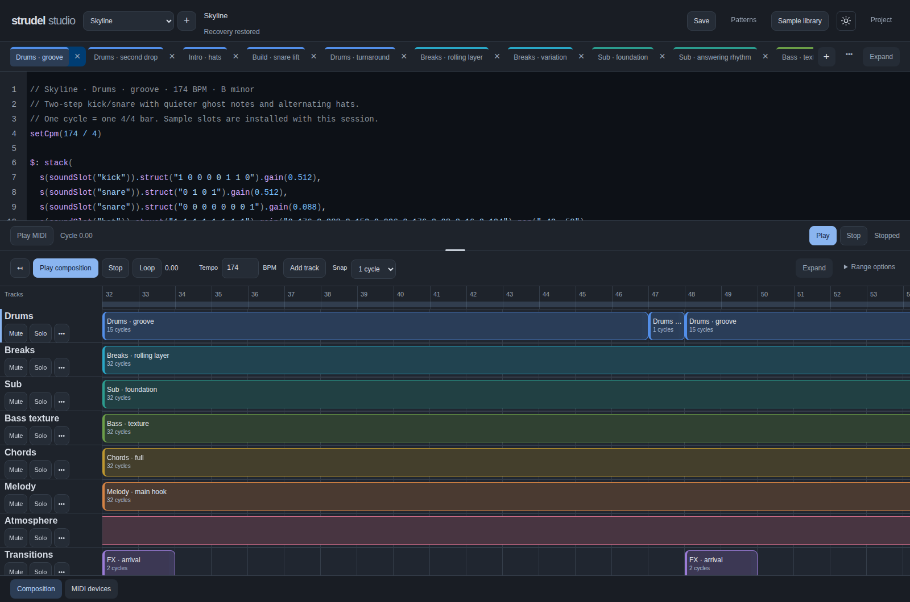

<p align="center">
  
</p>

<p align="center">
  <a href="#start-making-music">Start making music</a> ·
  <a href="#hear-the-demo">Hear the demo</a> ·
  <a href="#play-the-dnb-sessions">DnB sessions</a> ·
  <a href="docs/setup.md">Setup guide</a> ·
  <a href="CONTRIBUTING.md">Contribute</a>
</p>

<p align="center">
  <a href="LICENSE"></a>
</p>

**A focused place to turn code into music.** Write independent patterns, arrange colored tracks into a song, play and capture MIDI, bring in your own samples, and export a stereo WAV. Your sessions stay on your machine.

Strudel Studio is an **independent application built with [Strudel](https://strudel.cc)**, the open-source live-coding music environment. This repository adds a local studio workflow; it is not the upstream Strudel REPL or an official Strudel release.


*One editor. Tools when you need them. Neon Drive running entirely from synthesizers—no samples, account, or API key.*

## Start making music

Use **Linux, Node 24, npm, and a Chromium-based browser**. macOS and Windows are currently unverified.

```bash
git clone https://github.com/calv-io-n/strudel.git
cd strudel
npm ci
npm run studio:demo
npm run dev
```

Open **http://localhost:5173**. Choose **Sessions → Neon Drive**, open **Composition**, and press **Play composition**.

Normal installation does not download a browser or configure optional tools. Python, Bun, MIDI hardware, and an ElevenLabs key are not required for the demo. See [setup and troubleshooting](docs/setup.md) if you get stuck.

## Hear the demo

Right-click tabs to choose their colors. Arrange clips across up to 16 named tracks, mute tracks or clips, solo a track, and snap movement to 1, ½, or ¼ cycle.

**Neon Drive** is a 46-second synth-pop arrangement: four color-coded patterns, two tracks, and two mapped performance controls.

[](docs/media/walkthrough.webm)

[Watch or download the captioned walkthrough](docs/media/walkthrough.webm) · [Read the demo guide](patterns/sets/neon-drive/README.md)

1. Select **Neon Drive** from Sessions and open **Composition**.
2. Press **Play composition** and follow the clips in the timeline.
3. Open **Project → On-screen controller** and move **Lead brightness** or **Bass cutoff** to shape the sound.
4. Open **Export** and choose **Render & download WAV** to keep the full arrangement.

The demo installer preserves existing sessions. The walkthrough is a visual guide; hear the music by playing the demo locally.

## Play the DnB sessions



**Six original songs built around real samples.** Rolling breaks, sampled synths, layered bass and atmospheric pads meet editable Strudel melodies. Each song has a 128-bar arrangement: intro, build, first drop, breakdown, rebuild, a varied second drop, and outro—about three minutes including the effect tail.

| Session | Tempo / key | Character |
| --- | --- | --- |
| [First Light](patterns/sets/first-light/README.md) | 174 BPM · F♯ minor | Euphoric dancefloor, wide chords and a soaring lead |
| [Afterglow](patterns/sets/afterglow/README.md) | 174 BPM · A minor | Warm liquid DnB, softer breaks and spacious plucks |
| [Skyline](patterns/sets/skyline/README.md) | 174 BPM · B minor | Festival melody, suspended chords and a driving drop |
| [Solar Tide](patterns/sets/solar-tide/README.md) | 172 BPM · D minor | Sunlit plucks, glassy arpeggios and syncopated bass |
| [Higher Ground](patterns/sets/higher-ground/README.md) | 176 BPM · C minor | Bright staccato hooks and punchy, fast-moving drums |
| [Northern Lights](patterns/sets/northern-lights/README.md) | 174 BPM · E minor | Nocturnal pads and sparkling motifs opening into a melodic drop |

Follow the [DnB sample setup](patterns/sets/README.md) to download and extract three free SampleRadar packs. With Studio running, install the curated 26-sound selection and all six sessions from a second terminal:

```bash
npm run studio:dnb
```

Refresh Studio, choose a song in **Sessions**, and press **Play composition**. The original pair uses eight named tracks; the four additional songs add a ninth **Sparkle** track. Solo a track to study a part, edit its pattern, or change the arrangement. Use **Project → Export** for a stereo WAV.

The installer reuses identical samples and preserves existing named sessions. Song code and arrangements ship in this repository; the sample audio is downloaded separately and stays local. SampleRadar permits using these sounds in music, but not redistributing the raw samples. [Sources and installation details →](patterns/sets/README.md)

## From a pattern to a performance

| Workflow | In Studio |
| --- | --- |
| Write | Named tabs, code completion, inline sliders |
| Arrange | Up to 16 named tracks, clip colors, mute/solo, snapping, playhead and loop range |
| Perform | Virtual controls, optional MIDI hardware, live effects and MIDI take review |
| Sample | File, folder, ZIP and GitHub imports; searchable packs; recorded audio |
| Keep | Autosaved sessions, recovery drafts, stereo WAV export and portable project backups |

- **Keep control of what changes live.** Typing stays a draft until **Apply changes**; sliders and MIDI remain live. Stop silences playback, previews, and held notes.
- **Work directly on the thing you mean.** Right-click tabs to duplicate or rename, clips to edit or copy, and sounds to preview or insert. Menus support Shift+F10 and keyboard navigation.
- **Keep the editor in focus.** Composition, MIDI devices, the on-screen controller, Export and Sounds open when needed. A moon/sun toggle switches the entire workspace between light and dark.
- **Connect once, keep playing.** **MIDI devices** lists external inputs with Connect, Disconnect and live input feedback. Connections persist across songs, browser reloads and Studio restarts; unplugged controllers reconnect when they return. On-screen keys and knobs live separately under **Project → On-screen controller**.
- **Play a phrase before committing it.** Select a note expression and use **Play MIDI** to audition its instrument, capture notes over a composition range, compare the take with the original, and **Keep take** when ready. Quantization and take review help turn a performance into editable code.
- **Capture the sound, too.** Record the selected instrument with its effects, or an external microphone/interface. Preview, trim, name and save the take to the shared library, then insert it as a sample.

## Build your sound library

**Sample library** brings imported, recorded and generated sounds together. Search by name, preview a sound, insert it into a pattern or swap an existing sound. Rename packs and samples without breaking their references; **Live** lets you play a sound from MIDI or the test keys.

- **Import your collection.** Choose WAV, MP3, OGG or FLAC files, a folder, or a ZIP pack. Review the selection before importing. Identical files reuse the existing sound, and Studio retains originals alongside playback WAVs.
- **Pull samples from GitHub.** Paste a public repository or folder link, discover its audio, and download selected files for review. Configure `STUDIO_LIBRARIES` to cache selected GitHub WAV packs at startup.
- **Generate when you want to.** Describe a sound and use ElevenLabs with your own server-side API key. Generation happens only when you request it.

Imports allow up to 64 MB per source file, 256 MB unpacked and 500 files per review; codec support depends on the browser. Extract larger packs first and import a smaller selection. [Import, recording and recovery guide →](docs/workspace.md#import-samples-and-back-up-projects)

[Workspace and playback guide](docs/workspace.md) · [Design principles](docs/design/strudel-studio.md)

## What you need

| Workflow | Requirements |
| --- | --- |
| Studio, Neon Drive, virtual controls, WAV export | Linux + Node 24 + npm + Chromium-based browser |
| Six DnB sessions | Three free SampleRadar downloads, extracted locally; `npm run studio:dnb` while Studio is running |
| Browser audio recording | Browser audio-input access for an external mic/interface; internal instrument recording needs no microphone |
| Physical MIDI / OS loopback | Optional Python 3 and Linux/ALSA bridge |
| AI sound generation | Optional ElevenLabs key; provider charges and terms apply |
| Legacy external-editor watcher | Optional Bun 1.2+ and explicit `npm run setup:watcher` |
| Command-line recording / sample helpers | Optional FFmpeg; download helper also needs yt-dlp |

This release is a **local, single-user application**, not a hosted service. It listens on localhost; the optional sample server uses port 5555. [Full setup, environment variables and limitations →](docs/setup.md)

## Your music stays yours to manage

Sessions live in `.studio/projects/`; generated, imported and recorded sounds live in `samples/ai/`. Startup sample packs live in `samples/libraries/`. External MIDI connections are stored separately under `.studio/projects/.settings/` and stay specific to this installation. A session JSON contains sound references, not embedded audio.

Use **Project → Download project backup** to bundle the session with referenced audio and available originals. **Restore project backup** creates a new session and preserves existing ones. Backups report missing audio and external references; for projects over the 256 MB backup limit, copy the session and its referenced sound files directly.

Browser recovery protects interrupted edits, MIDI proposals, import reviews and unsaved audio takes, but is not a portable backup. Keep a take and save its audio before relying on a project backup. Exported pattern code preserves one pattern; exported WAV preserves the sound. [Data, recovery and migration details →](docs/setup.md#data-and-backups)

## Build with us

Start with [CONTRIBUTING.md](CONTRIBUTING.md), the [architecture guide](docs/architecture/README.md), or a focused [bug report](https://github.com/calv-io-n/strudel/issues/new/choose).

Our documentation separates intent, decisions, and implementation:

| Directory | Purpose | How to contribute |
| --- | --- | --- |
| [docs/design/](docs/design/README.md) | **Target build** — what the product should become. [strudel-studio.md](docs/design/strudel-studio.md) is the main target. | Propose intended behavior and acceptance criteria here. Keep implementation status in architecture docs; explain target changes in your PR. |
| [docs/adr/](docs/adr/README.md) | **Changes from the design** — decisions to depart from the target, with reasons and consequences. | Copy the ADR template, link the affected design section, describe the departure and alternatives, and submit it with the change. Preserve accepted decision history; supersede an old record when changing the decision. |
| [docs/architecture/](docs/architecture/README.md) | **As built** — how the current code actually works. | Update affected components, state flows, persistence rules, and limitations in the implementation PR. Link source files and validation; describe planned work in design instead. |

For a feature, start from the target design. If the implementation departs from it, include an ADR; if the target itself evolves, update the design and record the decision. Once code changes, update the as-built documentation to match. See the directory READMEs and [contribution guide](CONTRIBUTING.md) for the workflow.

```bash
npm run studio:build
npm run studio:test
npm run setup:browser-tests
npm run studio:e2e
```

CI runs the build, unit tests and browser suite on Linux/Node 24. Tests use isolated data and fixture sounds without paid API requests; the physical MIDI test requires an explicitly enabled hardware environment. [Security reporting](SECURITY.md) follows a separate private process.

## Open source, built on open source

Original project code and documentation are **AGPL-3.0-or-later**. Strudel and its contributors make the language and audio engine possible; their license and attribution remain in place. See [LICENSE](LICENSE) and [third-party notices](THIRD_PARTY_NOTICES.md) for source-sharing requirements and component attribution.

The synth-only demo, original DnB patterns and repository media are included with the project. SampleRadar audio is downloaded separately; external samples, user recordings and generated audio retain their own rights and terms.
