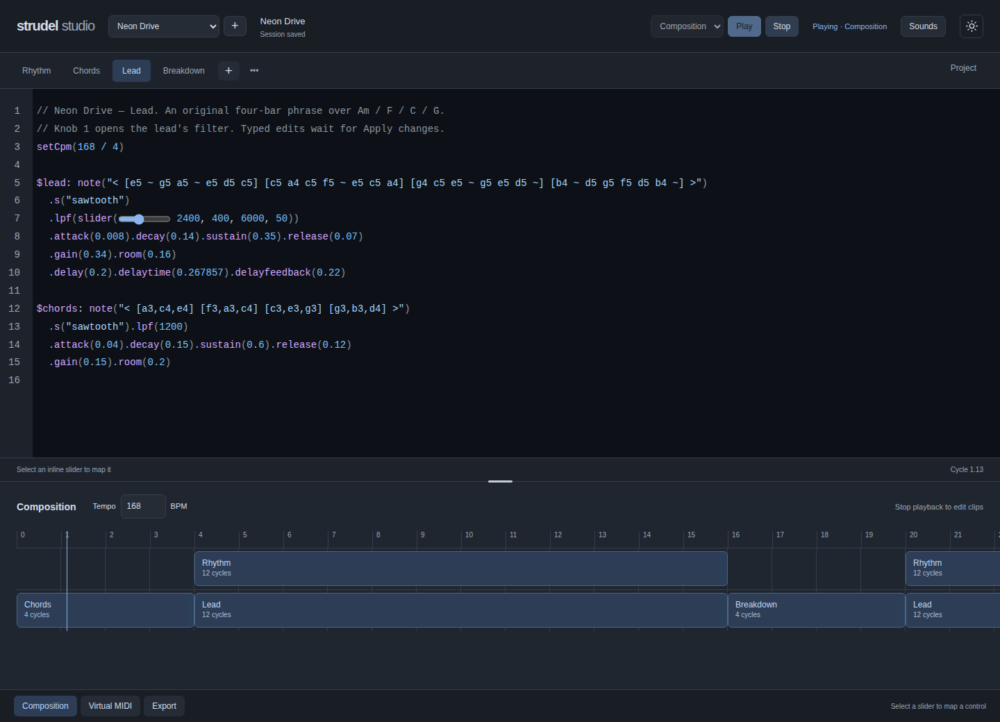
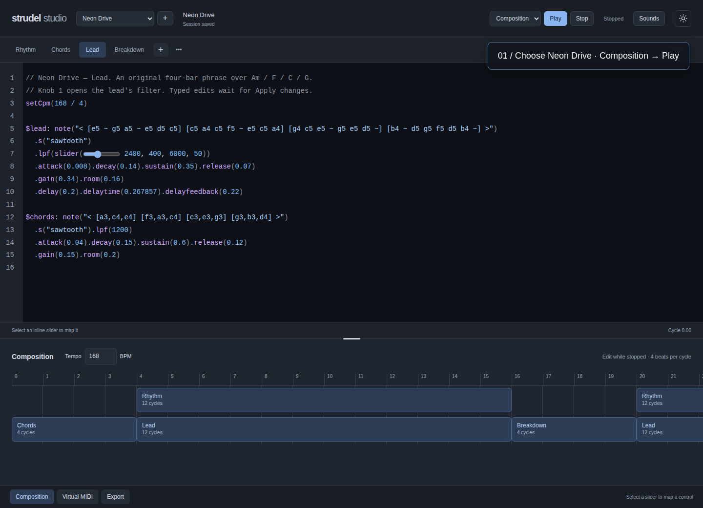

<p align="center">
  
</p>

<p align="center">
  <a href="#start-making-music">Start making music</a> ·
  <a href="#hear-the-demo">Hear the demo</a> ·
  <a href="docs/setup.md">Setup guide</a> ·
  <a href="CONTRIBUTING.md">Contribute</a>
</p>

<p align="center">
  <a href="LICENSE"></a>
</p>

**A focused place to turn code into music.** Write independent patterns, arrange two layers into a song, shape them with MIDI, and export a stereo WAV. Your sessions stay on your machine.

Strudel Studio is an **independent application built with [Strudel](https://strudel.cc)**, the open-source live-coding music environment. This repository adds a local studio workflow; it is not the upstream Strudel REPL or an official Strudel release.



*One editor. Tools when you need them. Neon Drive running entirely from synthesizers—no samples, account, or API key.*

## Start making music

Use **Linux, Node 24, npm, and a Chromium-based browser**. macOS and Windows are currently unverified.

```bash
git clone https://github.com/calv-io-n/strudel.git
cd strudel
npm ci
npm run studio:demo
npm run dev
```

Open **http://localhost:5173**. Choose **Sessions → Neon Drive**, set playback to **Composition**, and press **Play**.

Normal installation does not download a browser or configure optional tools. Python, Bun, MIDI hardware, and an ElevenLabs key are not required for the demo. See [setup and troubleshooting](docs/setup.md) if you get stuck.

## Hear the demo

**Neon Drive** is a 46-second synth-pop arrangement: four editable patterns, two lanes, and two mapped performance controls.

[](https://github.com/calv-io-n/strudel/blob/master/docs/media/walkthrough.webm)

[Watch or download the captioned walkthrough](docs/media/walkthrough.webm) · [Read the demo guide](patterns/sets/neon-drive/README.md)

1. Select **Neon Drive** from Sessions and choose **Composition** as the playback target.
2. Press **Play**. Open the Composition drawer to follow the clips.
3. Open **Virtual MIDI** and move **Lead brightness** or **Bass cutoff** to shape the sound.
4. Open **Export** and choose **Render & download WAV** to keep the full arrangement.

The demo installer preserves existing sessions. The walkthrough is a visual guide; hear the music by playing the demo locally.

## From a pattern to a performance

| Workflow | In Studio |
| --- | --- |
| Write | Named tabs, code completion, inline sliders |
| Arrange | Two lanes, whole-cycle clips, shared tempo |
| Perform | Virtual controls, optional MIDI hardware, live parameters |
| Keep | Autosaved sessions, recovery drafts, stereo WAV export |

- **Keep control of what changes live.** Typing stays a draft until **Apply changes**; sliders and MIDI remain live. Stop silences playback, previews, and held notes.
- **Work directly on the thing you mean.** Right-click tabs to duplicate or rename, clips to edit or copy, and sounds to preview or insert. Menus support Shift+F10 and keyboard navigation.
- **Keep the editor in focus.** Composition, Virtual MIDI, Export and Sounds open when needed. A moon/sun toggle switches the entire workspace between light and dark.
- **Bring your own sounds.** Use local samples, or optionally generate a sound through ElevenLabs with your own server-side key. Generation only happens when you request it.

[Workspace and playback guide](docs/workspace.md) · [Design principles](docs/design/strudel-studio.md)

## What you need

| Workflow | Requirements |
| --- | --- |
| Studio, Neon Drive, virtual controls, WAV export | Linux + Node 24 + npm + Chromium-based browser |
| Physical MIDI / OS loopback | Optional Python 3 and Linux/ALSA bridge |
| AI sound generation | Optional ElevenLabs key; provider charges and terms apply |
| Legacy external-editor watcher | Optional Bun 1.2+ and explicit `npm run setup:watcher` |
| Audio recording / sample helpers | Optional FFmpeg; download helper also needs yt-dlp |

This release is a **local, single-user application**, not a hosted service. It listens on localhost; the optional sample server uses port 5555. [Full setup, environment variables and limitations →](docs/setup.md)

## Your music stays yours to manage

Sessions live in `.studio/projects/`; generated sounds live in `samples/ai/`. Back up both directories together, plus any local samples your patterns reference. A session contains sound references, not embedded audio. Browser recovery helps with interrupted saves but is not a portable backup.

Exported pattern code preserves one pattern; exported WAV preserves the sound. Neither replaces a full editable-session backup. [Data, recovery and migration details →](docs/setup.md#data-and-backups)

## Build with us

Start with [CONTRIBUTING.md](CONTRIBUTING.md), the [architecture guide](docs/architecture.md), or a focused [bug report](https://github.com/calv-io-n/strudel/issues/new/choose).

```bash
npm run studio:build
npm run studio:test
npm run setup:browser-tests
npm run studio:e2e
```

CI runs the build, unit tests and browser suite on Linux/Node 24. Tests use isolated data and fixture sounds without paid API requests; the physical MIDI test requires an explicitly enabled hardware environment. [Security reporting](SECURITY.md) follows a separate private process.

## Open source, built on open source

Original project code and documentation are **AGPL-3.0-or-later**. Strudel and its contributors make the language and audio engine possible; their license and attribution remain in place. See [LICENSE](LICENSE) and [third-party notices](THIRD_PARTY_NOTICES.md) for source-sharing requirements and component attribution.

The synth-only demo and repository media are included with the project. External samples, user recordings and generated audio retain their own rights and terms.
