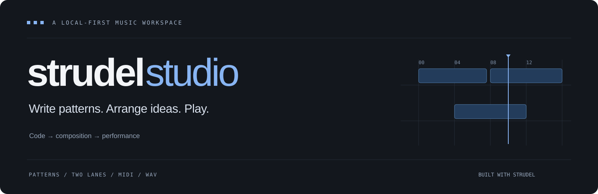

<p align="center"></p>

**A browser music studio built with [Strudel](https://strudel.cc).** Write patterns, arrange tracks, play MIDI, import samples, record audio, and export stereo WAV files. Projects and sounds save on your device, in your browser.

Studio is an independent application, not the upstream Strudel REPL or an official Strudel release.

## Start making music

Open the hosted site in a desktop Chromium-based browser. No installation, account, API key, or local server is required for visitors. Press **Play composition** to hear the synth-only **Neon Drive** starter. The sample library starts empty; install the optional CC0 drum kit from **Sample Catalogue** when you want it.

For local development, use Node 24 and npm:

```bash
npm ci
npm run dev
```

Open **http://localhost:5173**. Development and hosted builds use the same browser storage and audio engine.

## Host on Cloudflare Pages

Connect this repository to a Pages project with:

| Setting | Value |
| --- | --- |
| Root directory | Repository root |
| Build command | `npm run studio:build` |
| Build output directory | `studio/dist` |
| Environment variable | `NODE_VERSION=24` |

No Pages Functions, Workers, R2, database, or secrets are needed. Only the contents of `studio/dist` are published. You can also upload that directory as a Pages Direct Upload deployment.

```bash
npm run studio:build
npm run studio:preview
```

See the [hosting and migration guide](docs/setup.md). A production deployment has no `/api/` or WebSocket backend; Vite's development reload connection is only a development tool.

## Bring your own sounds

Choose **Import samples** in the header, or **Sample Catalogue → Add sounds → Import samples from GitHub or files**. The dedicated import page accepts public GitHub repository, folder, and audio-file links, with an optional branch, tag, or commit. Find samples, select the files you want, download them for review, then import. Downloads go directly from GitHub to your browser; nothing uploads to a Studio server.

File, folder, and ZIP uploads support WAV, MP3, OGG, and FLAC where the browser can decode them. Identical files reuse an existing sound. Imports retain originals, playback WAVs, and source information. Limits: 64 MB per source file, 256 MB per review, 500 files, and 15 minutes per sample. GitHub rate limits may require waiting or downloading files yourself and using Upload.

The build includes pack descriptions and a synth-only starter project, with no bundled sample audio. **Sample Catalogue** downloads the six original CC0 drums only after **Install pack**, and adds **Drum Basics**. Installation verifies pinned files and commits the whole pack atomically. Removal shows affected projects, preserves personal imports, and leaves references available for reinstall.

Other song examples remain in `patterns/sets/` as source material and are not bundled into the website. Their external audio must be acquired separately under its own license. There are no automatic sample-pack downloads or AI-generation requests.

## Write, perform, and keep your music

- Edit named pattern tabs and arrange clips across up to 16 tracks. Right-click for colors, duplication, mute/solo, and editing actions.
- Typed changes remain drafts until **Apply changes**. Sliders and MIDI stay live. Stop silences playback and held notes.
- Use the on-screen controller, or open **MIDI → Enable MIDI** and grant browser permission to connect hardware. Supported browsers reconnect remembered devices after permission has been granted. OS loopback and the former Python bridge are not used.
- Open **Audio input** to route a microphone/interface to a track. Edit `AUDIO.gain(slider(0.8, 0, 1)).lpf(6000).room(0.2)`, then Apply. Monitoring starts off. Use the red **Record audio input** button and track selector in Composition to create a recorded pattern automatically. Stop saves the take with your applied vocal effects and a retained dry original. Microphone permission is explicit.
- Use **Project → Export** for Full Song Render (44.1/48 kHz, 16/24-bit PCM or 32-bit float; default 48 kHz/24-bit), and **Project → Download project backup** to keep an editable session with its referenced audio and available originals.

Browser storage is specific to a browser profile and site address; it does not sync between devices. Clearing site data can erase projects and sounds. The import page displays storage usage and offers persistent storage, subject to the browser's decision. Keep downloaded backups. Localhost, preview URLs, and your final domain each have separate libraries.

## Development and verification

```bash
npm run studio:build
npm run studio:test
npm run setup:browser-tests
npm run studio:e2e
```

The browser suite tests the **production static build**: starter playback, imports, persistence, backups, WAV export, recording, MIDI, and failure handling. MIDI and input hardware are simulated for automated checks; actual GoXLR channels and latency need device testing. See the [audio workflow](docs/browser-audio.md) for supported effects, take timing, and render limits. See [architecture](docs/architecture/README.md) and [contributing](CONTRIBUTING.md).

## Licensing

Application code is **AGPL-3.0-or-later**. The original six starter samples and their generator are **CC0-1.0**. Imported audio retains its source license. See [LICENSE](LICENSE), [third-party notices](THIRD_PARTY_NOTICES.md), and the starter kit's license included in the website.
