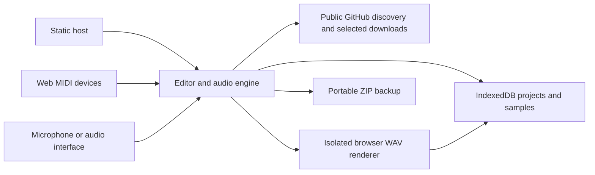

# As-built architecture

Studio is one static browser application. Vite builds the editor and an isolated WAV-renderer entry into `studio/dist`. Cloudflare Pages or another static HTTPS host can serve it without an application backend.

## Storage and audio

`studio/client/storage/` provides typed project, sample, recording, preset, and backup services. IndexedDB stores metadata and audio blobs, and Web Locks serialize operations that need uniqueness or deduplication across tabs. Transactions resolve on completion; failed asset/restore writes roll back atomically. Normal editor saves retain recovery drafts until persistence succeeds.

Audio assets use stable project IDs and managed blob URLs rather than server URLs. Live playback and the render frame each load audio from the same origin's database into their own audio environment. Originals are retained separately for portable ZIP backups. The renderer still isolates Strudel globals and effects from live playback.

The initial starter manifest contains Drum Basics and Neon Drive plus six synthesized CC0 WAVs. Seeding is transactional and happens once per browser database; subsequent visits do not overwrite starter edits. `scripts/build-starters.ts` deterministically regenerates the small deployable collection. No external packs or local user data enter the build.

## Import and performance input

`/#/samples/import` is a separate full-page view with direct GitHub discovery/download and existing file/folder/ZIP review. The editor remains mounted while the view changes. Discovery pins revisions to commits; bounded downloads preserve cancellation and per-file failures. Imported sounds are decoded locally into playback WAVs and deduplicated by original-content SHA-256.

Web MIDI replaces the Python/ALSA bridge and WebSocket transport. Enable MIDI is an explicit permission action; previously granted connections can resume on reload. Selected browser port IDs live in workspace settings, independently of projects. Note/CC parsing, slider pickup, performance capture, and virtual controls reuse shared music logic. Device disconnect releases held notes; unsupported browsers retain virtual controls. External recordings use browser microphone permission.

AI generation, the sample-server runtime, server diagnostics, and OS loopback are no longer part of the application. Remaining `studio/server/` filesystem helpers exist for old-format compatibility tests and starter tooling, not a running HTTP service. Historical API-driven browser specs are retained for reference; the production suite is `pages.spec.ts`.

## Compatibility and verification

Project schema v5 and migrations from v1–v4 remain unchanged. Existing ZIP backups preserve project/sample identities; restoration validates all collisions before a single transaction publishes audio and a newly named session. Cross-device and cross-origin migration is explicit backup/restore. Browser storage can be cleared or reach quota; the UI reports unsaved state and offers backups and persistent-storage requests.

The production browser suite verifies audible starter playback with external network blocked, storage reload, direct GitHub imports, failure/cancellation, backup restoration, sampled WAV export, Web MIDI, recording, and editor interactions. Domain and storage unit tests verify schema migrations, atomic failure, concurrency, duplicate content, malformed data, and archive collision handling. Hardware tests use simulated devices; physical-device behavior requires manual verification.

See [setup and migration](../setup.md), [composition internals](composition.md), and [ADR 0007](../adr/0007-browser-only-pages.md). Older architecture pages describe retained musical algorithms; references there to an HTTP server or ALSA transport are superseded by this document.
