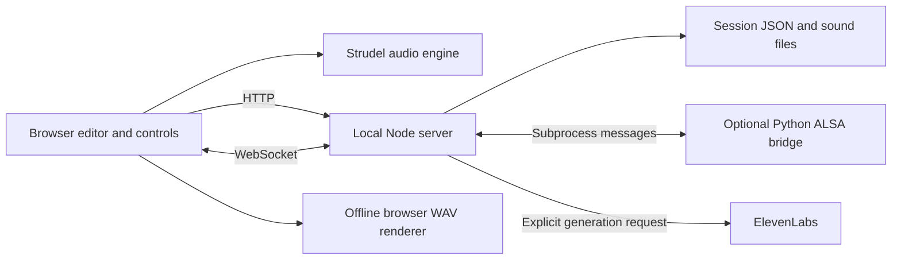

# As-built architecture

This directory describes implemented behavior and code boundaries. The [design](../design/strudel-studio.md) describes the target; [ADRs](../adr/README.md) explain decisions to depart from that target. Update this information alongside implementation changes.

Studio is a local Node server plus a browser audio/editor application. No hosted account or database is required.

- `studio/client/`: `main.ts` coordinates UI and shared user actions; `editor.ts` owns CodeMirror and stable slider identities; `engine.ts` owns playback and live updates. Context menus share the same actions as visible controls. `export.ts` and the isolated render page handle offline WAV rendering.
- `studio/shared/`: Zod project schemas and migrations, arrangement timing, clip placement, MIDI parsing/pickup, sliders, sample-slot timelines, and WAV encoding. Keep persistent-format rules here rather than duplicating them in UI code.
- `studio/server/`: localhost-only HTTP/WebSocket endpoints, atomic project storage, explicit sound-generation jobs, demo installation, and MIDI bridge coordination. Vite serves the client in middleware mode; `studio:build` does not create a standalone production server.
- `studio/midi/`: optional Linux/ALSA bridge and separate MIDI MCP tooling. The browser's virtual controls do not require these tools.
- `studio/tests/`: unit/integration tests and Playwright user flows. Browser configuration isolates sessions and sounds and uses fixture generation without API credits.

## State and compatibility

Projects contain tabs, composition clips, mappings, controller values and sound-slot references. Editors hold current code and slider anchors. Autosave writes the session and recovery snapshot; a browser draft covers interrupted saves. Audio playback uses applied pattern versions: typing does not silently replace playing code. Live slider and MIDI updates are deliberate exceptions.

Clip placement uses quarter-cycle increments and prohibits overlap within a track, including muted clips. Composition uses a shared tempo. Rendering snapshots current code and values into a separate browser context so it does not interrupt playback.

When evolving these boundaries, preserve project migration coverage, stop/cancel behavior, mapping identity, and deterministic fixture tests. Extract UI modules when a concrete change benefits from it; a wholesale framework migration is not required.

Composition projects use schema v5: ordered stable track IDs, named palette colors on tabs, per-track and per-clip mute settings, explicit asset references, optional clip source offsets and quarter-cycle clip timing. V1–v4 input migrates through the shared schema. Pointer gestures live in `studio/client/composition.ts`; grid and magnetic placement calculations are shared with keyboard/numeric validation in `studio/shared/clips.ts`. A separate mute timeline gates arrangement queries independently of compiled pattern versions, so Apply changes cannot overwrite queued mutes.

See [composition internals](composition.md) for persistence, scheduling, and gesture behavior.

See [performance input](performance-input.md) for the current MIDI, slider, and sound boundaries and the implementation gaps relative to the accepted Transcribe / Record target.

## Scrollbar styling

[Shared client CSS](../../studio/client/style.css) styles native scrollbars across the editor, tabs, composition, and scrollable panels. Light/dark tokens control neutral thumb colors. Browsers supporting scrollbar pseudo-elements use a 12px scrollbar with a 2px transparent inset, yielding an 8px rounded thumb, plus hover/active colors and transparent tracks/corners. Standard `scrollbar-width`/`scrollbar-color` properties provide a thin themed fallback; they reset to `auto` in the detailed-styling branch to avoid overriding the pseudo-elements. Custom rules are excluded in forced-colors mode. Scrolling stays browser-native; there is no JavaScript scrollbar or visibility timer.

## External MIDI connections

`studio/server/midi-connections.ts` stores selected external inputs atomically in `STUDIO_DATA_DIR/.settings/midi-connections.json`. `GET /api/midi/connections` reads `{ ports }`; `POST` changes one `{ port, connected }` choice and broadcasts a `midi-connections` WebSocket event. Serial updates merge changes from multiple pages. The bridge reuses these subscriptions across reconnects; browser closure and session changes never alter them. Legacy WebSocket `connect` messages are ignored.

The first initialization imports enabled hardware ports from saved project profiles once. Project profile IDs remain available to resolve old mappings. A fresh song gains profiles for selected inputs so external notes and MIDI Learn work immediately. The MIDI devices drawer shows only hardware selection, connection state and input activity. Project → On-screen controller retains virtual controls, mappings and diagnostics. Tests cover persistence, fresh-song input and browser/device lifecycle. See [ADR 0005](../adr/0005-external-midi-connections.md).

## Sample-based example sessions

`npm run studio:dnb` reads the six song arrangement manifests under `patterns/sets/`, imports the curated SampleRadar WAV selection through the existing import API, and creates schema-validated sessions through the project API. Named sample slots keep pattern code independent of asset UUIDs. Existing named sessions are preserved and imported content hashes reuse sounds. Downloaded packs and WAV renders stay gitignored; the repository contains original pattern code, arrangements and source metadata.
