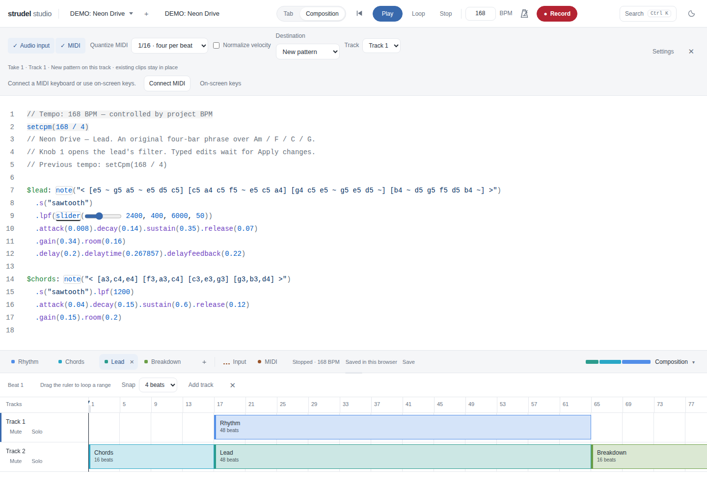

# Recording performance

MIDI quantization is on by default at 1/16 notes (four positions per beat). The Record bar offers Off, 1/4, 1/8, 1/16, and 1/32, and remembers the selection in this browser. Select the grid before recording; it stays fixed through capture and review, including recovery. Quantization snaps note starts and ends when preparing the transcription, with a minimum note length of one grid step. Raw captured timestamps and immediate live monitoring are preserved. This setting does not quantize microphone audio.

Normalize velocity sits beside quantization and is off by default. When enabled, recorded MIDI notes use a consistent velocity of 100/127 in preview and saved transcription. The browser remembers the preference, and each pending take retains its setting through recovery. Live monitoring and raw captured velocities remain unchanged.

Capture supports up to 15 minutes and 10,000 MIDI notes. A shared 64-voice budget bounds live MIDI synthesis, including release tails and sources still being prepared. Voice stealing affects monitoring only; every incoming note remains in the transcription until the note limit is reached. A limit or storage failure stops capture and retains the take for review. Released voices also reschedule Superdough's returned cleanup clock: otherwise its silent processing chains remain alive until the original maximum held-note duration, despite the voice budget.

The recording hot path no longer copies the note history, serializes it into localStorage, or regenerates and highlights the entire transcription. Active notes use a keyed index. IndexedDB checkpoints write changed notes and small recovery metadata every 250 ms, with one write in flight. Controller changes update sound and displayed values immediately; batched code edits occur after capture. Recovery preserves their latest checkpoint too.

After Stop, workers generate transcription, assemble chunked float WAVs, and inspect/hash large audio. Audio capture persists chunks throughout the take and retains at most 128 unsaved chunks per stream. Large review previews use a scrolling editor viewport. Finalizing and saving may still take longer for larger takes; capture work does not scale with the accumulated note history.

Saved MIDI uses nested time ranges so playback can skip inactive portions. Older literal recorder output receives the same optimization when evaluated; its stored code and slider offsets stay intact. Scheduling boundaries use explicit nanocycle fractions to avoid Fraction.js's costly approximation of arbitrary floating-point times. A syntax-tree cache bounded by 16 entries and two million characters avoids repeatedly parsing the same long transcription for editor decorations, slider detection, and tempo normalization.

Save and repeat regressions include new take placement on occupied tracks, workspace tab restoration after reload, audible playback after reload and a second start, combined audio/MIDI commits, failed saves and recovery. Overlapping clips are valid layers and no longer cause session validation to reject a saved take. Recovery cleanup is serialized with subsequent take writes.

## Verification

Run the production build and normal suites:

```sh
npm run studio:build
npm run studio:test
npm run studio:e2e
```

Run the real-time stress fixture against the built app:

```sh
STUDIO_CHROMIUM=/opt/google/chrome/chrome STUDIO_STRESS_SECONDS=900 \
  npx playwright test --config studio/playwright.config.ts recording-performance.spec.ts --grep 'dense MIDI'
```

The fixture sends eight notes per second, two mapped controller updates every 10 ms, and 64-note bursts each minute while backing loops and dry/wet microphone streams record. It checks captured versus saved note counts, early/late input handling time, event-loop delays, bounded audio cleanup clocks, continuous non-silent microphone chunks, and persistence after Keep take and reload. `STUDIO_STRESS_NOTE_RATE=80` exercises a much denser stream. `recording-stress.json` records measurements; `STUDIO_PROFILE=1` also saves a Chromium CPU profile. These are simulated browser inputs, not physical-device measurements.

During diagnosis, a 60-second run's worst timer gap fell from 550 ms to 56 ms after precise scheduling conversions. A subsequent 15-minute run retained every MIDI note but exposed audio-clock slowdown from delayed graph cleanup; that run did not pass. After fixing cleanup, a 90-second dense run retained all 7,126 notes and the full audio duration, with 0.4 ms p95 input handling, a 45 ms worst timer gap, and a maximum of 55 cleanup clocks returning to zero after Stop.

The saved-session regression edits and saves an 8,000-note legacy transcription, reloads it, and verifies audible output on two playback starts. Reload took 916 ms with syntax caching.

The corrected full 15-minute run passed: all 8,091 incoming notes were retained in the saved transcription after reload; dry and wet streams each contained 43,344,000 frames at 48 kHz (900 seconds of capture plus the three-second effects tail). Synchronous MIDI handling measured 0.3 ms p95 overall and 0.4 ms in both the first and last minute. The worst timer gap was 43.7 ms. Cleanup clocks peaked at 64 and returned to zero. The combined take reloaded in 1,221 ms.

Final verification passes the production build, all 91 unit tests, and all 92 regular browser tests. The browser suite covers recording controls, independent MIDI mappings, skip-to-beginning, saved transcription playback, recovery, and the resizable Composition layout. The optional 15-minute stress case is skipped in the regular suite and passed separately as documented above.


